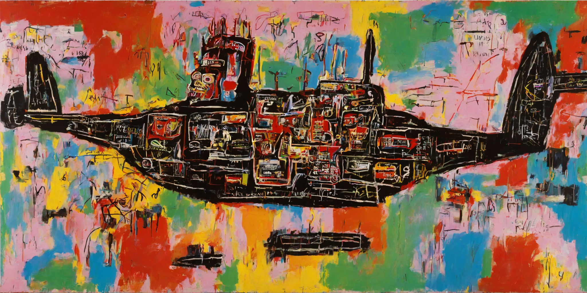
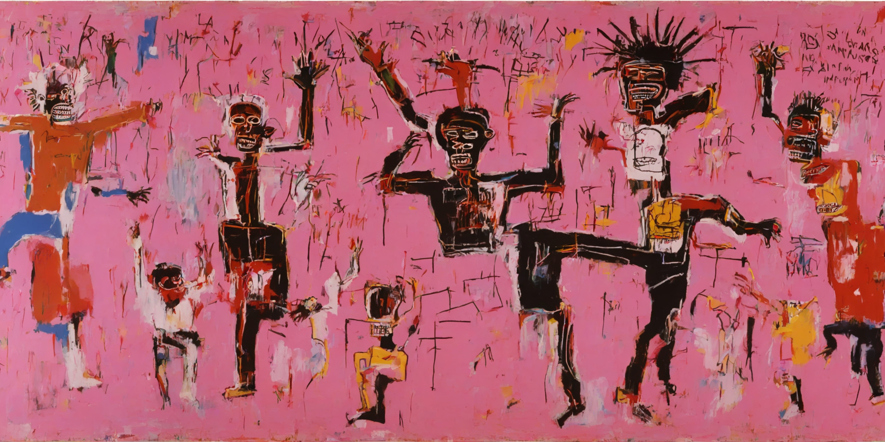

# sdxl-basquiat

My cog deployment of my stable-diffusion-xl-base-1.0 Lora finetuned on Basquiat paintings 

- API: https://replicate.com/georgedavila/sdxl-basquiat
- Model: https://huggingface.co/GDavila/sdxl-basquiat
- Dataset: https://huggingface.co/datasets/GDavila/Basquiat-Paintings

Trigger word: BASQUIAT

## Lora Outputs

"A BASQUIAT painting of a spaceship, rainbow background"

"A BASQUIAT painting of people dancing, pink background"

"A BASQUIAT painting of people dancing, pink background"

